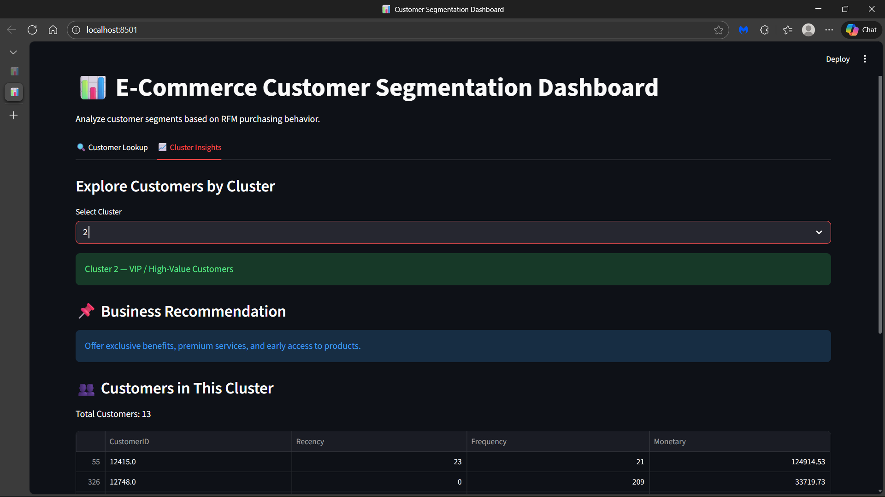

# E-commerce Customer Segmentation and Prediction

## 🔍 Algorithms & Models Implemented

This project applies the following techniques:

- RFM (Recency, Frequency, Monetary) Analysis – Feature Engineering
- K-Means Clustering – Customer Segmentation (Final Segmentation Model)
- Hierarchical Clustering – Model Comparison
- DBSCAN – Density-Based Clustering Comparison
- Logistic Regression – Classification Model
- Random Forest Classifier – Final Selected Prediction Model

---

## 📌 Project Overview

This project develops a machine learning-based customer segmentation and predictive classification system for an e-commerce business. Customers are segmented based on purchasing behavior and a predictive model is trained to classify customers into meaningful segments.

### 🎯 Business Goals

- Improve targeted marketing strategies
- Enhance customer retention
- Optimize marketing spend
- Identify VIP customers
- Detect churn-risk customers
- Support strategic decision-making

---

## 📊 Dataset Description

Transactional purchase data was used to compute customer-level RFM features:

- **Recency** – Days since last purchase
- **Frequency** – Total number of purchases
- **Monetary** – Total spending amount

Each row in the final dataset represents one customer.

---

## 🛠 Project Workflow

### 1️⃣ Data Preprocessing

- Removed missing values
- Removed negative/invalid transactions
- Converted date columns to datetime format
- Aggregated transactions at customer level
- Performed outlier analysis
- Applied Standard Scaling
- Applied PCA for dimensionality reduction and visualization

---

### 2️⃣ Feature Engineering – RFM Model

RFM metrics were calculated:

- Recency = Current Date – Last Purchase Date
- Frequency = Count of transactions
- Monetary = Total revenue per customer

---

## 🔎 Customer Segmentation (Clustering)

### ✅ K-Means Clustering (Selected Model)

Customers were segmented into **4 clusters**:

- **Cluster 0 – Regular Customers**
- **Cluster 1 – Lost / Low-Value Customers**
- **Cluster 2 – VIP / High-Value Customers**
- **Cluster 3 – Potential Loyal Customers**

### Other Algorithms Evaluated

- Hierarchical Clustering
- DBSCAN

**Why K-Means was selected:**
- Clear cluster separation
- Better interpretability
- Scalable performance
- Business-friendly segmentation output

---

## 🤖 Predictive Modeling

After clustering, supervised models were trained to predict customer segments.

### 1️⃣ Logistic Regression  
Accuracy: **1.00**

### 2️⃣ Random Forest Classifier (Final Model Selected)  
Accuracy: **0.9965**

### ✅ Why Random Forest Was Selected

- Handles non-linear relationships
- Strong multi-class classification performance
- Higher macro-average F1 score
- Robust against overfitting
- More stable predictions
- Better generalization capability

Random Forest was selected as the final production model.

---

## 📈 Model Performance Summary

| Model | Accuracy | Notes |
|--------|----------|--------|
| Logistic Regression | 1.00 | Binary Testing |
| Random Forest | 0.9965 | Multi-class (Selected Model) |

---

## 📊 Visual Insights

- Pie Chart – Revenue Contribution by Cluster (Sum of Monetary)
- Bar Chart – Average RFM values per Cluster
- Line Chart – Recency vs Average Frequency (Customer Engagement Trend)

---

## 🚀 Deployment Process

The trained Random Forest model was deployed to predict customer segments using RFM input values.

### Deployment Steps

1. Train Random Forest model
2. Save model using `joblib`
3. Create customer lookup interface
4. Accept user input (Recency, Frequency, Monetary)
5. Predict cluster using trained model
6. Display customer segment result

---

## 🖥️ Deployment Screenshots

### 🔹 Customer Lookup Interface

---

### 🔹 Cluster Prediction Output

---

## 📦 Libraries Used

- pandas
- numpy
- matplotlib
- seaborn
- scikit-learn
- scipy
- joblib
- warnings

---

## 💼 Business Impact

This solution enables:

- Data-driven customer segmentation
- Targeted marketing campaigns
- Improved customer retention
- Identification of VIP customers
- Churn risk detection
- Revenue optimization
- Strategic inventory planning

---

## 📌 Conclusion

This project demonstrates how RFM-based customer segmentation combined with machine learning classification can transform raw transaction data into actionable business intelligence. By implementing K-Means clustering and a Random Forest classifier, the system enables accurate customer categorization, improves marketing precision, enhances customer satisfaction, and supports long-term revenue growth.

---

## 🔮 Future Enhancements

- Real-time model integration
- Web app deployment (Flask / Streamlit)
- Customer Lifetime Value prediction
- Marketing recommendation system
- Integration with BI dashboards

---

## 📌 Project Status

Completed and Ready for Deployment
